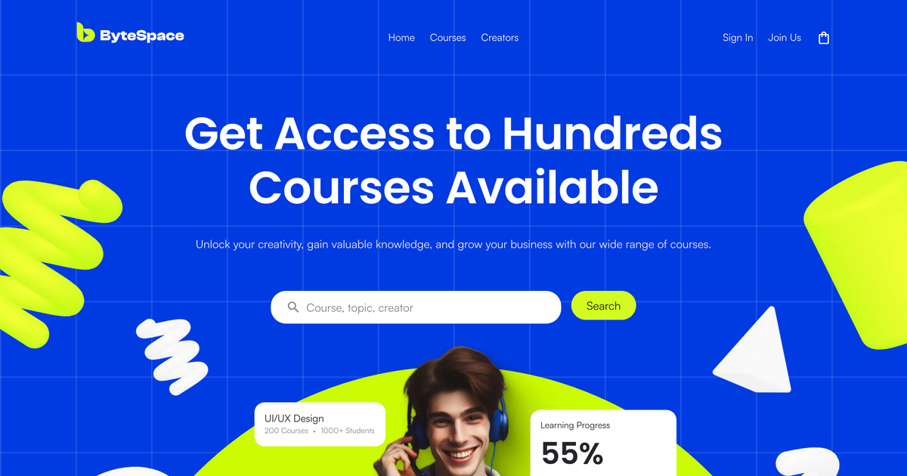

# ByteSpace

Landing page for ByteSpace, an online course platform, built from the Figma design with Next.js, TypeScript and Tailwind CSS.

- Live site: https://bytespace-website-navy.vercel.app
- Pull request: https://github.com/Soumik205/bytespace-website/pull/1



## Stack

| Concern | Choice |
| --- | --- |
| Framework | Next.js 16 (App Router), React 19, TypeScript in strict mode |
| Styling | Tailwind CSS v4, design tokens declared with `@theme` in `src/app/globals.css` |
| Fonts | `next/font`: Poppins from Google Fonts, Satoshi and Clash Display self hosted |
| Images | `next/image`, photos and 3D shapes as WebP, logos and icons as SVG |
| Forms | `react-hook-form` with `zod` |
| Tooling | ESLint (Next.js config), Prettier with `prettier-plugin-tailwindcss`, pnpm |
| Hosting | Vercel, production builds from `main` |

## Getting started

Requires Node 20 or newer and pnpm.

```bash
pnpm install
pnpm dev        # http://localhost:3000
```

Other scripts:

```bash
pnpm build      # production build
pnpm start      # serve the production build
pnpm lint       # ESLint
pnpm format     # Prettier on src/
```

## Project structure

```
src/
├── app/
│   ├── layout.tsx        fonts, metadata, html and body
│   ├── page.tsx          landing page, only composes sections
│   ├── globals.css       Tailwind import, tokens, grid and glow backgrounds
│   ├── icon.svg          favicon
│   └── fonts/            Satoshi and Clash Display (woff2)
├── components/
│   ├── ui/               Button, Container, Logo, AvatarStack, Shape, Artboard
│   ├── cards/            CourseCard, ProgressCard, HappyStudentsCard
│   ├── forms/            SearchForm, NewsletterForm
│   ├── layout/           Header, MobileMenu, Footer
│   ├── sections/         one component per landing page section
│   └── icons/            single color icons as components (currentColor)
├── content/
│   └── landing.ts        navigation, courses, categories, testimonials, footer links
└── lib/
    ├── utils.ts          cn() helper
    └── validation.ts     zod schemas
public/
├── images/               photos, avatars, course covers and 3D shapes (WebP)
├── logos/                partner logos (SVG)
└── og.png                social preview image
```

## How the design was translated

**Tokens.** Every color, text style, radius and the 1200px content width from the design lives in `globals.css` as a Tailwind token (`bg-primary`, `text-ink-soft`, `text-h2`, `rounded-card`, `max-w-content` and so on). Components use no raw hex values.

**Sections.** `page.tsx` is a list of section components in the same order as the Figma frame. Each section is a server component. Only the interactive leaves are client components: the mobile menu, the topic filter, the search form and the newsletter form.

**Content.** Repeated content (navigation, partner logos, topics, courses, categories, stats, testimonials, footer links) is typed data in `src/content/landing.ts` and mapped in the components. One off headings and paragraphs stay in their section.

**Overlapping illustrations.** The hero, growth and creator sections each have a composition of overlapping layers (photo, floating cards, 3D shapes). These sit in an `Artboard` component that keeps the layers at their design coordinates and scales the whole board down on smaller screens, so the composition never breaks apart. Text and layout around them use normal flex and grid.

**Assets.** Photos, avatars and course covers are served as WebP through `next/image`. The 3D shapes are grayscale renders tinted with a hard light blend in Figma; they were exported with that blend applied, so the page only loads plain transparent WebP files. The two student photos include the soft drop shadow from the design.

## Decisions and assumptions

- **Fonts.** The design uses Poppins (headings), Satoshi (body) and Clash Display (logo wordmark). Poppins loads from Google Fonts through `next/font`. Satoshi and Clash Display are free fonts from Fontshare under the ITF Free Font License and are self hosted in `src/app/fonts`.
- **Breakpoints.** The Figma file only has a 1440px desktop frame. The page matches that frame at 1440px and keeps the content centered up to 1920px and beyond. Below that it uses Tailwind's default breakpoints: three course columns from 1280px, two from 768px, one below; the header collapses into a menu button with a full screen dialog below 1024px; the illustrations scale down instead of reflowing.
- **Copy.** Text matches the design exactly, including "the Power of Big Data", "@ 2023 ByteSpace" and the "Search" label on the newsletter button. Long course titles are truncated with an ellipsis as in the design.
- **Links.** Home, Courses and Creators scroll to their sections. Sign In and Join Us (and Join as Creator) go to `/login` and `/signup`. Links to pages outside this task point to `#`.
- **Forms.** The hero search jumps to the course list. The newsletter form validates the email address and shows a confirmation; nothing is sent anywhere.
- **Topic chips.** The chips work as a toggle group (one active topic at a time). The design shows a single course list, so selecting a topic does not change the cards.
- **Small differences between repeated cards.** Figma has slightly different spacing between the two copies of the "Learning Progress" and "Happy Students" cards and between the testimonial cards. The shared components follow the larger copy; where the difference was visible a small variant prop covers it.
- **Accessibility.** One `h1`, headings in order, landmarks for header, nav, main and footer, labels on every input, visible focus rings, `aria-pressed` on the topic chips, decorative layers hidden from screen readers, and smooth scrolling only when the visitor allows motion.

## Lighthouse

Mobile, production URL, median of three runs on October 1, 2026:

| Performance | Accessibility | Best Practices | SEO |
| --- | --- | --- | --- |
| 91 | 97 | 100 | 100 |

Cumulative Layout Shift is 0 and Total Blocking Time is 0 ms. The only accessibility finding is color contrast: the design's muted gray (`#82868E`) on white measures 3.65:1, below the 4.5:1 that WCAG AA asks for body text. It is used for the section intros and some card details. The design colors were kept as they are.

## What I would do with more time

- Build the Login and Signup pages and the 404 page from their Figma frames.
- Load real courses per topic so the chips filter the list.
- Add visual regression tests that compare each section with the design at 1440px.
